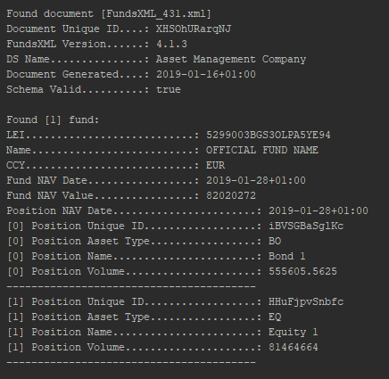

# FundsXML 4.3.1 Example

This is an example of creating and reading FundsXML Files with [XML Beans](https://xmlbeans.apache.org/).  
A compiled schema (jar) is provided on [the FundsXML schema site](http://schema.fundsxml.at) and als library in this project.

Two fund holdings (1 bond, 1 equity) are created on the fly randomly.   

## basics
* Language:   Java
* difficulty: Beginner


| PRO          | CON                    |
  ------------ | ------------------------
| static typed | lot of typing needed   |
| very fast    |                        |
| runs on all major operating systems | |
| schema validity can be checked inside the source code | |

The programm is running on Java 11.  
If you want to run it on Java 8 - remove the module-info.java file an change the sourceCompatibility and targetCompatibility from 11 to 1.8  

```Java
sourceCompatibility = 1.8
targetCompatibility = 1.8
```

## how to run the example
This example uses [gradle](https://gradle.org/) as build tool.  
Clone the source code or download it as a zip file. 

Windows: 
```Shell
gradlew.bat run
```

Linux:
```Shell
./gradlew run
```

## output 
Here is an example output of writing a FundsXML File with "CreateFundsXMLFile.java":


Here is an example output of reading a FundsXML File with "ReadFundsXMLFile.java":
